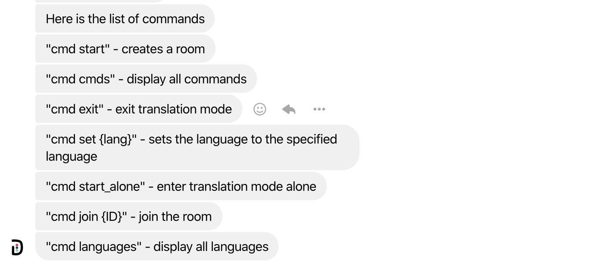
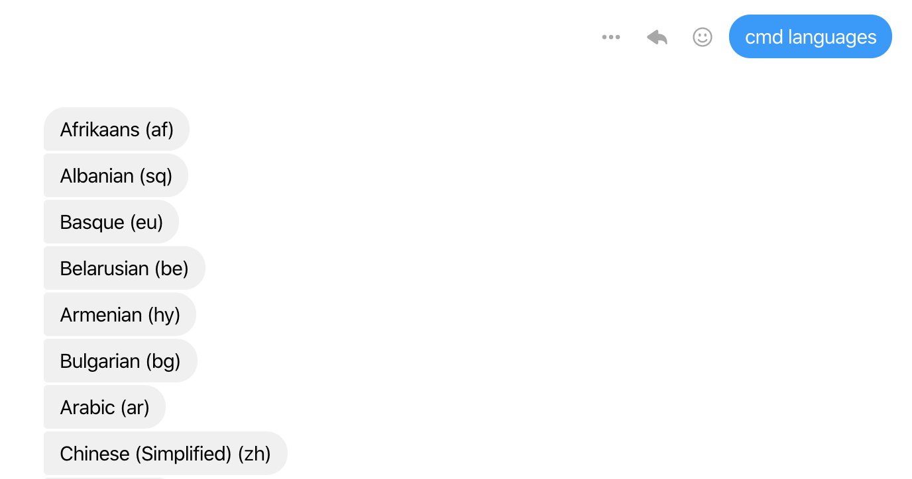

# Decipher-Me

  

DecipherMe is a translation integrated facebook bot created using the Zendesk Sunshines conversation API, and Google Translate API to break down language barriers by having messages sent in your native language. (Winner of the Zendesk API Challenge at ConUHacks V)

| Commands:  | Response | Description |
| ------------- |  :---:   | :--- |
| cmd commands  |  | List of all of the possible commands |
| cmd set {language}  |  | Sets the language of the user using the language code |
| cmd languages  |  | List of all of the possible languages and their code |
|  cmd start_alone  |   | Start learning mode and have words translated back to you |
|  cmd start  |   | Start a conversation with someone where they use the command to join the conversation |
| cmd exit  |     | Exits learning mode or conversation mode for you |

## Services

Unfortunately due to costs, the service provided has been stopped, but feel free to use this project as inspiration for further work!

## Inspiration
In Québec, it can be difficult getting a grasp between English and French. Fundamentally, from this one key idea, the whole project was born. We wanted to create a solution where the user would be able to tackle the task of learning a language without much disruption to their daily life. Although you can't force anyone else to talk in the language you want to learn, with DecipherMe, every message on Messenger gets you that much closer to becoming fluent in another language!

## What it does
DecipherMe is a web application that seamlessly translates Facebook messages from one language to another, allowing people to learn new languages and allows those with different native languages to connect with each other. The idea is that one individual can practice the new language they want to learn without impacting the other user. It translates the original message, allows the user to respond in that language but that response will then get translated back into the original language before being sent back. From the original sender's perspective - nothing different has happened. However, the user using DecipherMe has gotten one step closer to becoming a master in a different language.

## Why we created this project
Multiple studies have shown that learning a new language increases cognitive function, improving the user's long-term ability to remember information and ability to concentrate. Moreover, they have proven how learning a language can be one of the steps that helps improve an individual's mental health. Learning a new language pushes individuals to develop new perspectives and gain a deeper connection to others that may not have existed before. It can help individuals feel less isolated and gain a sense of purpose. Even more, learning a language helps individuals become more employable. As the world becomes more and more interconnected, moving forward in the workplace means that everyone you speak to may not have the same level of comfort in your native language. The more languages you can speak, there are more opportunities that you can pursue on an international field. The future of business is in expansion and interconnection; the future of business is remaining united in our similarities and taking the tiem to celebrate our differences.

## How we built it
Using Flask and Zendesk Sunshine, the program first retrieves the contents of the message that need to be translated. This is achieved by plugging the message into a Google Cloud Translate API. The Sunshine API is then used to send this translated version back. The user is then able to send a translated message back to the page and have the message get sent back as a reply in the original language.

## Challenges we ran into
One of the largest challenges was time. Due to all the different connections in the development environment, running and compiling the project so that we could test the final result became incredibly tedious. Every time the project was run with a small error, more time would have to be spent just waiting for the project to finally update. In the future, we would love to work on producing a more optimized version of the code so that we could test our project on the fly. Another challenge we encountered was a variety of obscure error codes and bugs. When setting up the whole environment, there were many instances where the project would display a up a less-than-helpful error message where we would have to spend a bit of time figuring out what exactly was causing the new error.

## Accomplishments that we're proud of
We're proud of the impact DecipherMe could achieve in learning a new language. Having this opportunity to be constantly pushed to engage in the language you are trying to learn can be the push needed to finally acquire a new language. DecipherMe makes learning a new language fun, accessible, and effective - it targets the 3 main challenges that users face when trying to learn a new language. This application could make it easier for everyone from an eager student to someone trying to get a deeper understanding of their culture to new immigrants who want to overcome the language barrier they are facing.

## What we learned
We learned a lot more about how Flask, Google Cloud, and Zendesk Sunshine can all come together to create an amazing product. It has been phenomenal getting to look into and truly understand all the different applications of the Sunshine API. We have been grateful for the support from the Zendesk team in answering our questions and explaining a bit more what their products have to offer. Additionally, our team got a better understanding of what different components we would need to accomplish before the end result could become what we expected. Improving our ability to take a project and break it down into every single little component that blocks the final product is an incredibly important tool in software development that we're glad we got to improve on.

## What's next for DecipherMe
In the future, DecipherMe could adopt the functionality of corrections. This development would allow the other user the option to see the translation and fix some of mistakes that they see. This would be useful if the user you are talking to is proficient in the language you would like to learn.

Link to bot: https://www.facebook.com/DecipherM/
